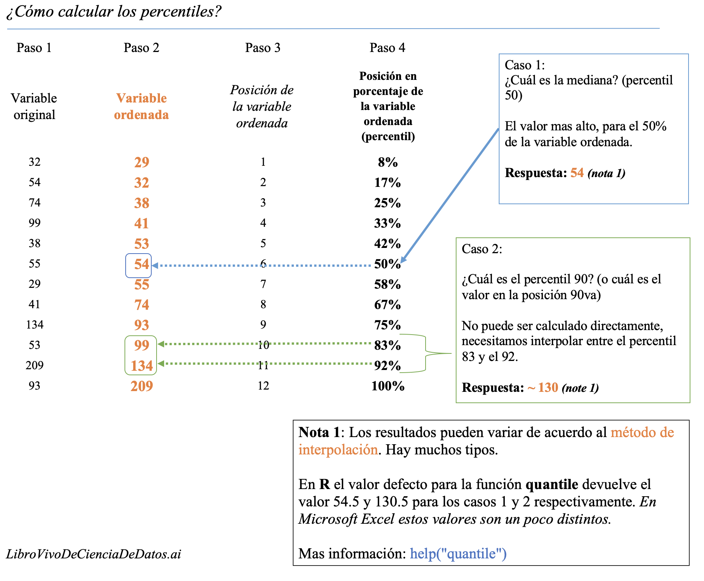

```{r include = FALSE}
if(!knitr:::is_html_output())
{
  options("width"=56)
  knitr::opts_chunk$set(tidy.opts=list(width.cutoff=56, indent = 2), tidy = TRUE)
  knitr::opts_chunk$set(fig.pos = 'H')
}
```

# APÉNDICE {#apendice}

Lectura complementaria.


## La magia de los percentiles {#apendice-percentiles}

El percentil es un concepto tan crucial en el análisis de datos que vamos a cubrirlo ampliamente en este libro. Considera cada observación con respecto a las demás. Un número aislado puede no ser significativo, pero cuando se compara con otros, aparece el concepto de distribución.

Los percentiles se utilizan en el análisis numérico, así como en la evaluación del rendimiento de un modelo predictivo.

<br>

```{r how-to-calculate-percentiles, echo=FALSE, out.width="100%", fig.cap="Cómo calcular percentiles", out.extra=''}

```


<br>

**El conjunto de datos, un consejo antes de continuar:**

Esto contiene muchos indicadores sobre el desarrollo mundial. Independientemente del ejemplo del análisis numérico, la idea es proporcionar una tabla lista para usar para sociólogos, investigadores, etc. interesados en analizar este tipo de datos.

La fuente de datos original es: <a href="http://databank.worldbank.org/data/reports.aspx?source=2&Topic=11#" target="blank">http://databank.worldbank.org</a>. Ahí encontrarán un diccionario de datos que explica todas las variables.

En esta sección utilizaremos una tabla que ya está preparada para el análisis. La preparación completa de los datos paso a paso se encuentra en el capítulo [Análisis numérico](#analisis_numerico).

Pueden buscar el significado de cualquier indicador en data.worldbank.org. Por ejemplo, si queremos saber qué significa `EN.POP.SLUM.UR.ZS`, entonces escribimos: http://data.worldbank.org/indicator/EN.POP.SLUM.UR.ZS


<br>

### Cómo calcular percentiles

Existen varios métodos para obtener el percentil. Basado en interpolaciones, la forma más fácil es ordenar la variable de forma ascendente, seleccionando el percentil que deseamos (por ejemplo, 75%), y luego observando _cuál es el valor máximo si queremos elegir el 75% de la población ordenada_.

Ahora vamos a usar la técnica de mantener la muestra pequeña para que podamos tener el máximo control sobre _lo que está sucediendo_ detrás del cálculo.

Conservamos los 10 países aleatorios y visualizamos el vector de `rural_poverty_headcount`, que es la variable que vamos a utilizar.

```{r, tidy=FALSE, warning=FALSE, message=FALSE}
library(dplyr)

data_world_wide =
  read.delim(file="https://goo.gl/NNYhCW", 
             header = T
             )

```

```{r}
data_sample=filter(data_world_wide, Country.Name %in% c("Kazakhstan", "Zambia", "Mauritania", "Malaysia", "Sao Tome and Principe", "Colombia", "Haiti", "Fiji", "Sierra Leone", "Morocco")) %>% arrange(rural_poverty_headcount)

select(data_sample, Country.Name, rural_poverty_headcount)
```

Tengan en cuenta que el vector se ordena sólo con fines didácticos. _Como dijimos en el capítulo de Análisis numérico, a nuestros ojos les gusta el orden._

Ahora aplicamos la función "cuantitativa" a otra variable (el porcentaje de la población rural que vive por debajo de las líneas de pobreza): 

```{r}
quantile(data_sample$rural_poverty_headcount)
```

**Análisis**

* **Percentil 50%**: el 50% de los países (cinco de ellos) tienen una `rural_poverty_headcount` debajo de `51.7`. Podemos comprobar esto en la última tabla: estos países son: Fiji, Colombia, Marruecos, Kazajistán, y Malasia.
* **Percentil 25%**: el 25% de los países están por debajo de 20.87. Aquí podemos ver una interpolación porque el 25% representa ~2.5 países. Si utilizamos este valor para filtrar los países, entonces tendremos tres países: Marruecos, Kazajistán, y Malasia.

Más información sobre los diferentes tipos de cuantiles y sus interpolaciones: `help("quantile")`.

#### Obtener las descripciones semánticas

Del último ejemplo podemos afirmar que: 

* _"La mitad de los países tienen hasta un 51.7% de pobreza rural"_
* _"Tres cuartas partes de los países tienen un máximo de 64.4% en cuanto a su pobreza rural"_ (basado en los países ordenados ascendentemente).

También podemos pensar en **usar lo contrario**: 

* _"Una cuarta parte de los países que presentan los valores más altos de pobreza rural tienen un porcentaje de por lo menos 64.4%"_


### Calcular cuantiles personalizados

Típicamente, queremos calcular ciertos cuantiles. La variable de ejemplo será el `gini_index`.

**¿Qué es el Índice de Gini?**
  
Es una medida de la desigualdad de ingresos o de riqueza.

* Un coeficiente de Gini de **cero** expresa **igualdad perfecta** donde todos los valores son iguales (por ejemplo, donde todos tienen los mismos ingresos). 
* Un coeficiente de Gini de **1** (o 100%) expresa **desigualdad máxima** entre los valores (por ejemplo, en un gran número de personas, donde sólo una persona tiene todos los ingresos o el consumo mientras que todas las demás no tienen ninguno, el coeficiente de Gini será muy cercano a uno).

Fuente: https://en.wikipedia.org/wiki/Gini_coefficient

**Ejemplo en R**:

Si queremos obtener los cuantiles de 20, 40, 60, y 80 de la variable del índice de Gini, volvemos a usar la función `quantile`. 

El parámetro `na.rm=TRUE` es necesario si tenemos valores vacíos como en este caso:

```{r, warning=FALSE}
# También podemos obtener múltiples cuantiles en simultáneo
p_custom=quantile(data_world_wide$gini_index, probs = c(0.2, 0.4, 0.6, 0.8), na.rm=TRUE)
p_custom
```


### Indicar dónde están la mayoría de los valores

En estadística descriptiva, queremos describir la población en términos generales. Podemos hablar de rangos usando dos percentiles. Tomemos los percentiles 10 y 90 para describir al 80% de la población.

_La pobreza oscila entre el 0.075% y el 54.4% en el 80% de los países_. (80% porque hicimos percentil 90 - percentil 10, centrándonos en la mitad de la población.)

Si consideramos al 80% como la mayoría de la población, entonces podríamos decir: _"Normalmente (o en términos generales), la pobreza pasa de 0.07% a 54.4%"_. Esta es una descripción semántica.

Observamos al 80% de la población, que parece ser un buen número para describir dónde están la mayoría de los casos. También podríamos haber usado el rango del 90% (percentil 95 - percentil 5). 

#### ¿El percentil se relaciona con el cuartil?

**Cuartil** es el nombre formal para los percentiles 25, 50 y 75 (cuartos o 'Q'). Si queremos observar el 50% de la población, debemos restar el 3er cuartil (o percentil 75) del 1er cuartil (percentil 25) para saber dónde está concentrado el 50% de los datos, también conocido como el **rango intercuartil** o IQR.


Percentil vs. cuantil vs. cuartil

```
0 cuartil = 0 cuantil = 0 percentil
1 cuartil = 0.25 cuantil = 25 percentil
2 cuartil = .5 cuantil = 50 percentil (mediana)
3 cuartil = .75 cuantil = 75 percentil
4 cuartil = 1 cuantil = 100 percentil
```

Créditos: [@perc_quan_quar].

### Visualizar cuantiles

Graficar un histograma junto a los lugares donde se encuentra cada percentil puede ayudarnos a entender el concepto:

```{r, profiling-numerical-variable, warning=FALSE, message=FALSE, fig.height=3.5, fig.width=5, tidy=FALSE, fig.cap="Visualizar cuantiles", out.extra=''}
quantiles_var = 
  quantile(data_world_wide$poverty_headcount_1.9, 
           c(0.25, 0.5, 0.75), 
           na.rm = T
           )

df_p = data.frame(value=quantiles_var, 
                quantile=c("25th", "50th", "75th")
                )

library(ggplot2)
ggplot(data_world_wide, aes(poverty_headcount_1.9)) + 
  geom_histogram() +
  geom_vline(data=df_p, 
             aes(xintercept=value, 
                 colour = quantile),
             show.legend = TRUE, 
             linetype="dashed"
             ) + 
  theme_light()

```

Si sumamos todas las barras grises antes del percentil 25, tendrán aproximadamente la misma altura acumulada que la suma de las barras grises después del percentil 75.

En el último gráfico, el IQR aparece entre la primera y la última línea punteada y contiene el 50% de la población.

### Conceptos de clasificación y top/bottom '_X%_'

El concepto de clasificación es el mismo que el de las competiciones. Nos permite responder _¿cuál es el país con la tasa más alta en la variable pop_living_slums?_

Usaremos la función `dense_rank` del paquete `ggplot2`. Asigna la posición (puesto) a cada país, pero las necesitamos en orden inverso; es decir, asignamos el `rank = 1` al valor más alto.

Ahora la variable será: _La población que vive en hogares marginales es la proporción de la población urbana que vive en hogares marginales. Un hogar marginal se define como un grupo de individuos que viven bajo el mismo techo y que carecen de una o más de las siguientes condiciones: acceso a agua potable, acceso a saneamiento mejorado, suficiente área habitable y durabilidad de la vivienda._

La pregunta a responder: _¿Cuáles son los seis países con las tasas más altas de personas que viven en hogares marginales?_

```{r, tidy=FALSE}
# Crear la variable de clasificación
data_world_wide$rank_pop_living_slums = 
  dense_rank(-data_world_wide$pop_living_slums) 
```

```{r}
# Ordenar los datos según la clasificación
data_world_wide=arrange(data_world_wide, rank_pop_living_slums)

# Visualizar los primeros seis resultados
select(data_world_wide, Country.Name, rank_pop_living_slums) %>% head(.) 
```

También podemos preguntar: _¿En qué posición está Ecuador?_

```{r}
filter(data_world_wide, Country.Name=="Ecuador") %>% select(rank_pop_living_slums)
```


##### Concepto de top/bottom '_X%_'

Otra pregunta que podría interesarnos responder: _¿Cuál es el valor con el que obtengo el 10% superior de los valores más bajos?_

El percentil 10 es la respuesta:

```{r}
quantile(data_world_wide$pop_living_slums, probs=.1, na.rm = T)
```

Trabajando en lo opuesto: _¿Cuál es el valor con el que obtengo el 10% inferior de los valores más altos?_

El percentil 90 es la respuesta, podemos filtrar todos los casos por encima de este valor:

```{r}
quantile(data_world_wide$pop_living_slums, 
         probs=.9, 
         na.rm = T
         ) 
```


### Uso de percentiles en el scoring de datos

Hay dos capítulos que usan este concepto:

* [Scoring de datos](#scoring_de_datos)
* [Análisis de Ganancia y Lift](#ganancia_y_lift)

La idea básica es desarrollar un modelo predictivo que prediga una variable binaria (`yes`/`no`). Supongamos que necesitamos puntuar nuevos casos, por ejemplo, para utilizarlos en una campaña de marketing. La pregunta a responder es:

_¿Cuál es el valor del puntaje que deberíamos sugerirle a los ejecutivos de ventas para capturar el 50% de las nuevas ventas potenciales?_ La respuesta proviene de una combinación de análisis de percentil sobre el valor del puntaje más el análisis acumulativo de la variable objetivo actual.

```{r gain-lift-curve, echo=FALSE, out.width="80%", fig.cap="Curvas de ganancia y lift (desempeño del modelo)", out.extra=''}
knitr::include_graphics("model_performance/gain_curve.png")
```

<br>

#### Estudio de caso: Distribución de la riqueza

La distribución de la riqueza es similar a la del índice de Gini y se centra en la desigualdad. Mide los activos de los propietarios (que son diferentes de los ingresos), haciendo que la comparación entre países sea más uniforme con lo que las personas pueden adquirir según el lugar en el que viven. Para una mejor definición, consulten el artículo de _Wikipedia_ y el _Informe sobre el patrimonio mundial 2013_. Referencias: [@distr_wealth] y [@global_wealth], respectivamente.

Citando a _Wikipedia_ (Ref. [@distr_wealth]):

> la mitad de la riqueza mundial pertenece al 1% de la población;

> el 10% superior de los adultos posee el 85%, mientras que el 90% inferior posee el 15% restante de la riqueza total del mundo; y

> el 30% de los adultos más ricos poseen el 97% de la riqueza total.

Al igual que antes, a partir de la tercera frase podemos afirmarlo: _"El 3% de la riqueza total se distribuye entre el 70% de los adultos"._

Las métricas `top 10%` y `top 30%` son los quantiles `0.1` y `0.3.` La riqueza es la variable numérica.

<br>

  
---

```{r, echo=FALSE}
knitr::include_graphics("introduction/spacer_bar.png") 
```

---

<br>

## Quick-start `funModeling` 

Este paquete contiene un conjunto de funciones relacionadas con el análisis exploratorio de datos, la preparación de datos y el desempeño del modelo. Es utilizado por personas procedentes de los negocios, la investigación y la docencia (profesores y estudiantes).

El paquete `funModeling` está íntimamente relacionado con este libro, en el sentido de que la mayor parte de su funcionalidad se utiliza para explicar los diferentes temas abordados por el libro.

### Abriendo la caja negra 

Algunas funciones tienen comentarios incluidos en las líneas para que el usuario pueda abrir la caja negra y aprender cómo se desarrolló, o para afinar o mejorar cualquiera de ellas. 

Todas las funciones están bien documentadas, explicando todos los parámetros con la ayuda de muchos ejemplos breves. Se puede acceder a la documentación en R a través de: `help("name_of_the_function")`.


**Cambios importantes desde la última versión 1.6.7**, (esto sólo es relevante si estaban usando versiones anteriores):

A partir de la última versión, 1.6.7 (21 de enero de 2018), los parámetros `str_input`, `str_target` y `str_score` se renombrarán a `input`, `target` y `score` respectivamente. La funcionalidad sigue siendo la misma. Si estaban utilizando estos nombres de parámetros en producción, seguirán funcionando hasta la próxima versión. Esto significa que, por ahora, pueden utilizar, por ejemplo, `str_input` o `input`.

El otro cambio importante fue en `discretize_get_bins`, que se detalla más adelante en este documento.

<br>

#### Sobre este quick-start

Este quick-start se centra sólo en las funciones. Pueden consultar todas las explicaciones en torno a ellas, así como el cómo y cuándo utilizarlas, siguiendo los enlaces "_**Leer más aquí.**_" que se encuentran debajo de cada sección, que los redirigirán al libro.

A continuación está la mayoría de las funciones de `funModeling` divididas por categoría.

### Análisis exploratorio de datos

#### `df_status`: Estado de salud de un conjunto de datos

Caso de uso: analiza los ceros, los valores faltantes (`NA`), el infinito, el tipo de datos y el número de valores únicos para un conjunto de datos determinado.

```{r, message=FALSE, warning=FALSE}
library(funModeling)

df_status(heart_disease)
```

[`r emo::ji("mag_right")` [**Leer más aquí.**](#estado-de-salud-de-un-conjunto-de-datos)]

<br>


#### `plot_num`: Graficar las distribuciones de variables numéricas

Solamente grafica variables numéricas.

```{r, fig.height=3, fig.width=5, fig.cap="plot num: visualizar variables numéricas", out.extra=''}
plot_num(heart_disease)
```

Notas:

* `bins`: configura la cantidad de segmentos (10 por defecto).
* `path_out`: indica el directorio donde se guardará el archivo; si tiene un valor, entonces el gráfico se exportará en formato jpeg. Para guardarlo en el directorio actual debe ser un punto: "."

[`r emo::ji("mag_right")` [**Leer más aquí.**](#graficar-variables-numericas)]


<br>

#### `profiling_num`: Calcular varias estadísticas para variables numéricas

Obtiene varias estadísticas para variables numéricas.

```{r}
profiling_num(heart_disease)
```

Nota: 

* `plot_num` y `profiling_num` automáticamente excluyen variables no numéricas

[`r emo::ji("mag_right")` [**Leer más aquí.**](#analisis-numerico-en-r)]

<br>

#### `freq`: Obtener las distribuciones de frecuencia de variables categóricas 

```{r distribution-categorical-variable, message=FALSE, fig.height=3, fig.width=5, warning=FALSE, fig.cap="freq: visualizar variables categóricas", out.extra=''}
library(dplyr)

# Seleccionar sólo dos variables para este ejemplo
heart_disease_2=heart_disease %>% select(chest_pain, thal)

# Distribución de la frecuencia
freq(heart_disease_2)
```


Notas: 

* `freq` sólo procesa variables `factor` y `character`, excluyendo variables no categóricas.
* Devuelve la tabla de distribución como un data frame.
* Si `input` está vacío, entonces se ejecuta para todas las variables categóricas.
* `path_out` indica el directorio donde se guardará el archivo; si tiene un valor, entonces el gráfico se exportará en formato jpeg. Para guardarlo en el directorio actual debe ser un punto: "."
* `na.rm` indica si los valores `NA` deberían ser excluidos (`FALSE` por defecto).

[`r emo::ji("mag_right")` [**Leer más aquí.**](#analisis-variables-categoricas)]


<br>

### Correlaciones

#### `correlation_table`: Calcula el estadístico R

Obtiene la métrica R (o coeficiente de Pearson) para todas las variables numéricas, saltándose las categóricas.

```{r}
correlation_table(heart_disease, "has_heart_disease")
```

Notas: 

* Sólo se analizan las variables numéricas. La variable objetivo debe ser numérica.
* Si la variable objetivo es categórica, entonces será convertida a numérica.

[`r emo::ji("mag_right")` [**Leer más aquí.**](#correlacion-lineal)]


<br>

#### `var_rank_info`: Correlación basada en Teoría de la Información

Calcula la correlación basándose en distintas métricas de la Teoría de la Información entre todas las variables de un data frame y una variable objetivo.

```{r}
var_rank_info(heart_disease, "has_heart_disease")
```

Nota: Analiza variables numéricas y categóricas. También se utiliza con el método de discretización numérica como antes, tal como `discretize_df`.


[`r emo::ji("mag_right")` [**Leer más aquí.**](#seleccionar_factores_var_clas_info)]


<br>

#### `cross_plot`: Gráfico de distribución entre variable de entrada y variable objetivo

Obtiene la distribución relativa y absoluta entre una variable de entrada y una variable objetivo.
Es útil para explicar y reportar si una variable es importante o no.

```{r profiling-variable-predictive-modeling, fig.height=4, fig.width=8, results=FALSE,fig.cap="cross plot: Visualizar variable de entrada vs. variable objetivo", out.extra='', message=FALSE}
cross_plot(data=heart_disease, input=c("age", "oldpeak"), target="has_heart_disease")
```

Notas: 

* `auto_binning`: `TRUE` por defecto, muestra la variable numérica como categórica.
* `path_out` indica el directorio donde se guardará el archivo; si tiene un valor, entonces el gráfico se exportará en formato jpeg.
* `input` puede ser numérica o categórica, y `target` debe ser una variable binaria (dos clases).
* Si `input` está vacío, entonces se ejecutará para todas las variables.

[`r emo::ji("mag_right")` [**Leer más aquí.**](#analisis_objetivo_cross_plot)]

<br>

#### `plotar`: Diagramas de caja e histogramas de densidad entre variables de entrada y objetivo

Es útil para explicar y reportar si una variable es importante o no.

**Diagrama de caja:**

```{r boxplot-analysis, fig.height=2, fig.width=4, fig.cap="plotar (1): visualizar un diagrama de caja", out.extra=''}
plotar(data=heart_disease, input = c("age", "oldpeak"), target="has_heart_disease", plot_type="boxplot")
```

[`r emo::ji("mag_right")` [**Leer más aquí.**](#analisis-numerico-diagramas-caja)]

<br>

**Histogramas de densidad:**

```{r density-histogram, fig.height=2, fig.width=4,fig.cap="plotar (2): visualizar histograma de densidad", out.extra=''}
plotar(data=mtcars, input = "gear", target="cyl", plot_type="histdens")
```

[`r emo::ji("mag_right")` [**Leer más aquí.**](#analisis-numerico-histogramas-densidad)]

Notes:

* `path_out` indica el directorio donde se guardará el archivo; si tiene un valor, entonces el gráfico se exportará en formato jpeg.
* Si `input` está vacío, entonces se ejecuta para todas la variables numéricas (saltéandose las categóricas).
* `input` debe ser numérico y la variable objetivo debe ser categórica.
* `target` puede ser multi-clase (no sólo binario).

<br>

#### `categ_analysis`: Análisis cuantitativo para un resultado binario

Hace un análisis numérico de una variable binaria objetivo basándose en una variable categórica de entrada, la representatividad (`perc_rows`) y la precisión (`perc_target`) de cada valor de la variable de entrada; por ejemplo, la tasa de infección por gripe por país.

```{r}
df_ca=categ_analysis(data = data_country, input = "country", target = "has_flu")

head(df_ca)
```
    
Nota: 

* La variable `input` debe ser categórica.
* La variable `target` debe ser binaria (dos valores posibles).

Esta función se utiliza para analizar datos cuando necesitamos reducir la cardinalidad de las variables en el modelado predictivo.

[`r emo::ji("mag_right")` [**Leer más aquí.**](#alta_cardinalidad_modelo_predictivo)]


### Preparación de datos

#### Discretización de datos

##### `discretize_get_bins` + `discretize_df`: Convertir variables numéricas a categóricas

Necesitamos dos funciones: `discretize_get_bins`, que devuelve los umbrales para cada variable, y luego `discretize_df`, que toma el resultado de la primera función y convierte las variables deseadas. El criterio de segmentación es el de igual frecuencia.

Ejemplo: convertir sólo dos variables de un conjunto de datos.

```{r}
# Paso 1: Obtener los umbrales de las variables deseadas: "max_heart_rate" y "oldpeak"
d_bins=discretize_get_bins(data=heart_disease, input=c("max_heart_rate", "oldpeak"), n_bins=5)
```

```{r, tidy=FALSE}
# Paso 2: Aplicar el umbral para llegar al
# data frame final
heart_disease_discretized = 
  discretize_df(data=heart_disease, 
                data_bins=d_bins, 
                stringsAsFactors=T
                )
```

La siguiente imagen ilustra el resultado. Por favor noten que el nombre de la variable no cambió.

```{r data-discretization, echo=FALSE, out.width="80%", fig.cap="Resultados del proceso de discretización automática", out.extra=''}
knitr::include_graphics("appendix/data_discretization_1.png")
```


Notas: 

* Este procedimiento de dos pasos está pensado para ser utilizado en producción con nuevos datos.
* Los valores mín y máx de cada segmento serán `-Inf` e `Inf`, respectivamente.
* Un cambio en la última versión de `funModeling` (1.6.7) puede alterar el resultado en algunos escenarios. Por favor verifiquen los resultados si están usando la versión 1.6.6. Más información sobre este cambio [aquí](https://s3.amazonaws.com/datascienceheroes.com/img/blog/changes_discretize_df.png).

[`r emo::ji("mag_right")` [**Leer más aquí.**](#discretizacion-datos)]


<br>

#### `convert_df_to_categoric`: Convertir cada columna de un data frame a variables carácter

La segmentación, o el criterio de discretización para cualquier variable numérica es igual frecuencia. Las variables factor son convertidas directamente a variables carácter.

```{r, results=FALSE, message=FALSE}
iris_char=convert_df_to_categoric(data = iris, n_bins = 5)

# Verificar las primeras filas
head(iris_char)
```


#### `equal_freq`: Convertir variable numérica a categórica

Convierte un vector numérico en factor usando el criterio de igual frecuencia.

```{r}
new_age=equal_freq(heart_disease$age, n_bins = 5)

# Verificar los resultados
Hmisc::describe(new_age)
```

[`r emo::ji("mag_right")` [**Leer más aquí.**](#segmentacion-igual-frecuencia)]

Notas:

* A diferencia de `discretize_get_bins`, esta función no inserta `-Inf` y `Inf` como los valores mín y máx, respectivamente.

<br>

#### `range01`: Escala la variable en el rango de 0 a 1

Convierte un vector numérico a una escala que va de 0 a 1, donde 0 es el mínimo y 1 es el máximo.

```{r}
age_scaled=range01(heart_disease$oldpeak)

# Verificar los resultados
summary(age_scaled)
```

<br>

### Preparación de datos con valores atípicos

#### `hampel_outlier` y  `tukey_outlier`: Obtiene el umbral de los valores atípicos

Ambas funciones obtienen un vector de dos valores que indica el umbral en el que los valores son considerados atípicos.
Las funciones `tukey_outlier` y `hampel_outlier` son utilizadas internamente en `prep_outliers`.


**Usando el método de Tukey:**

```{r}
tukey_outlier(heart_disease$resting_blood_pressure)
```

[`r emo::ji("mag_right")` [**Leer más aquí.**](#detectar-valores-atípicos-usando-método-Tukey)]

<br>

**Usando el método de Hampel:**

```{r}
hampel_outlier(heart_disease$resting_blood_pressure)
```

[`r emo::ji("mag_right")` [**Leer más aquí.**](#detectar-valores-atípicos-usando-método-Hampel)]


<br>

#### `prep_outliers`: Preparar los valores atípicos de un data frame

Toma un data frame y devuelve el mismo data frame más las transformaciones especificadas en el parámetro `input`. También funciona con un sólo vector.

Ejemplo tomando dos variables como datos de entrada:

```{r}
# Obtener el umbral según el método de Hampel
hampel_outlier(heart_disease$max_heart_rate)

# Aplicar la función para frenar los valores atípicos en los valores del umbral
data_prep=prep_outliers(data = heart_disease, input = c('max_heart_rate','resting_blood_pressure'), method = "hampel", type='stop')

```

Verificar el antes y después de la variable `max_heart_rate`:

```{r, echo=FALSE}
# Verificar el valor máx y mín de 'max_heart_rate' antes de la transformación
sprintf("Before transformation -> Min: %s; Max: %s", min(heart_disease$max_heart_rate), max(heart_disease$max_heart_rate))

# Aplicar la función para frenar los valores atípicos en los valores del umbral
data_prep=prep_outliers(data = heart_disease, input = c('max_heart_rate','resting_blood_pressure'), method = "hampel", type='stop')

# Al verificar los resultados, el valor máximo ahora es 174.5 (el mínimo queda igual)
# Verificar los valores máx y mín de 'max_heart_rate' antes de la transformación
sprintf("After transformation -> Min: %s; Max: %s", min(data_prep$max_heart_rate), max(data_prep$max_heart_rate))

```

El valor mínimo cambió de 71 a 86.23, mientras que el valor máximo queda igual, en 202.

Notas:

* `method` puede ser: `bottom_top`, `tukey` o `hampel`.
* `type` puede ser: `stop` o `set_na`. Si es `stop` todos los valores marcados como atípicos serán frenados en el umbral. Si es `set_na`, entonces los valores marcados serán tomados como `NA`.

[`r emo::ji("mag_right")` [**Leer más aquí.**](#como_lidiar_con_valores_atipicos_en_r)]


<br>

### Desempeño de un modelo predictivo

#### `gain_lift`: Curva de desempeño de ganancia y lift

Después de calcular los scores o probabilidades de la clase que queremos predecir, los pasamos a la función `gain_lift`, que devuelve un data frame con métricas de desempeño.

```{r predictive-model-performance, fig.height=3, fig.width=7, fig.cap="ganancia y lift: visualizando el desempeño de un modelo predictivo", out.extra=''}
# Crear un modelo de machine learning y obtener sus puntajes para casos positivos
fit_glm=glm(has_heart_disease ~ age + oldpeak, data=heart_disease, family = binomial)
heart_disease$score=predict(fit_glm, newdata=heart_disease, type='response')

# Calcular las métricas de desempeño
gain_lift(data=heart_disease, score='score', target='has_heart_disease')

```

[`r emo::ji("mag_right")` [**Leer más aquí.**](#ganancia_y_lift)]

<br>


---

```{r, echo=FALSE}
knitr::include_graphics("introduction/spacer_bar.png")
```

---


