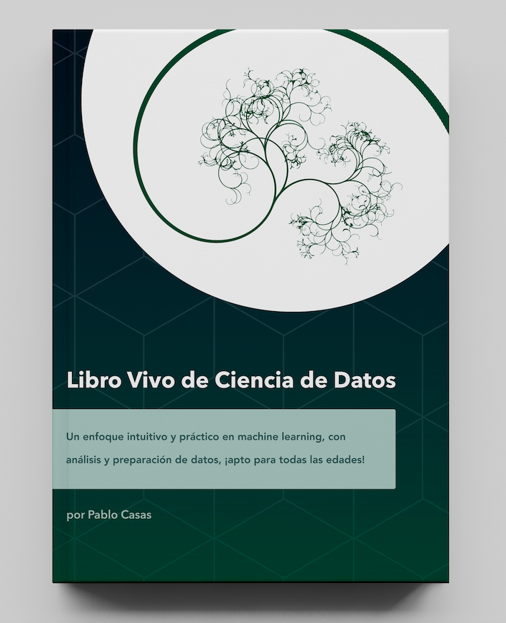
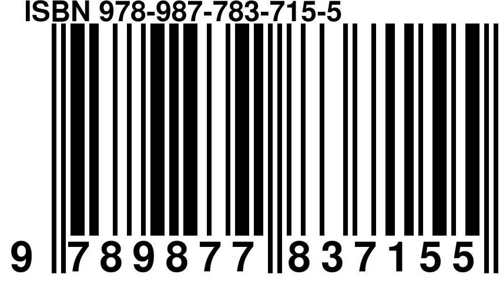

--- 
title: "Libro Vivo de Ciencia de Datos"
author: "Pablo Casas"
date: "`r format(Sys.time(), '%B %Y')`"
site: bookdown::bookdown_site
output: bookdown::gitbook
classoption: oneside
bibliography: [packages.bib, book.bib]
biblio-style: apalike
link-citations: yes
favicon: "introduction/favicon.ico"
cover-image: "introduction/libro_vivo_de_ciencia_de_datos_cover.png"
github-repo: pablo14/libro-vivo-ciencia-datos
description: "Un enfoque intuitivo y práctico en machine learning, con análisis y preparación de datos, ¡apto para todas las edades!"
linestretch: 1.15
linkcolor: NavyBlue
links-as-notes: true
url: 'https\://librovivodecienciadedatos.ai/'
twitter-handle: pabloc_ds
---


---

```{r include = FALSE}
if(!knitr:::is_html_output())
{
  options("width"=56)
  knitr::opts_chunk$set(tidy.opts=list(width.cutoff=56, indent = 2), tidy = TRUE)
  knitr::opts_chunk$set(fig.pos = 'H')
}
source('./emojis.R')
```


# Prefacio {-}

```{r, echo=FALSE}
if (knitr:::is_html_output())
{
  
}
```


<br>

### Acerca de esta edición {-}

Finalmente disponible la versión en español del _Data Science Live Book_! El libro se abre sin barreras idiomáticas ante las personas de habla-hispana con ganas de aprender.

Esta publicación es una edición revisada tanto en gramática como en aspectos técnicos de la versión en inglés.

El _Data Science Live Book_, junto con dos artículos de como auto-publicar un libro usando bookdown, fueron premiados por RStudio en el [1st Bookdown Contest](https://community.rstudio.com/t/announcing-winners-of-the-1st-bookdown-contest/16394). 

El objetivo es que puedan acercarse con un enfoque intutitivo y práctico al mundo de la ciencia con datos, el arte del descubrimiento.

<br> 


### Curso introductorio de R gratuito {-}

```{r echo=FALSE, out.width="300px"}
knitr::include_graphics("introduction/Desembarcando_en_R.png")
```

Con el curso **[Desembarcando en R](https://www.udemy.com/desembarcando-en-r)**, podrán obtener una gentil introducción a los aspectos mas distintivos de R, mediante sus 11 laboratorios y 19 videos de programación cortos.


Pueden inscribirse gratis a al curso: **[Desembarcando en R > 2da Edición!](https://escueladedatosvivos.ai/p/curso-desembarcando-en-r-2da-edicion-gratis). La 1ra edición tuvo mas de 6000 inscriptos. 

Este curso, y otros mas, son parte de la nueva [Escuela de Datos Vivos](https://escueladedatosvivos.ai/).


Es un curso complementario a este libro. Solo se requieren conocimientos básicos de programación.

Modalidad 100% práctica, se ven introducciones a las librerías R Base, `tidyverse`, `funModeling`, `Hmisc`, `randomForest`. Al final de cada laboratorio se plantean ejercicios (con su resolución).

Al finalizar, pueden calificarlo, compartir y hacer sus comentarios :)

<br>


### ¿Por qué leer este libro? {-}

Este libro facilitará el entendimiento de problemas comunes en el análisis de datos y machine learning. 

Construir un modelo predictivo es tan complejo como una línea de código en `R`: 

```{r, eval=FALSE, echo=TRUE}
mi_super_modelo=randomForest(target ~ var_1 + var_2, mis_datos_complicados)
```

Eso es todo. 

Pero, en la práctica los datos tienen su suciedad. Debemos esculpirlos, como hace un artista, para exponer su información y encontrar respuestas (y nuevas preguntas).

Hay muchos desafíos para resolver, algunos conjuntos de datos requieren más _esculpido_ que otros. Para dar un ejemplo, random forest no acepta valores vacíos, ¿qué hacemos entonces? ¿Quitamos las filas que tienen conflictos? ¿O transformamos los valores vacíos en otros valores? **¿Cuál es la implicancia**, en cualquier caso, para _mis_ datos?

Además del problema de los valores vacíos, debemos enfrentar otras situaciones, como los valores extremos (outliers) que suelen sesgar no solamente el modelo en sí mismo, sino también la interpretación de los resultados finales. Es común "intentar adivinar" _cómo_ interpreta el modelo predictivo cada variable (ordenando las mejores variables), y cuáles son los valores que aumentan (o disminuyen) la probabilidad de que ocurra algún evento (análisis numérico de variables).

Decidir el **tipo de datos** de las variables puede no ser algo menor. Una variable categórica _podría ser_ numérica y viceversa, dependiendo del contexto, los datos, y el algoritmo mismo (algunos sólo pueden manejar un tipo de datos). Esta conversión también tiene sus propias implicancias en _cómo el modelo ve las variables_.

Este es un libro sobre la preparación de los datos, el análisis de los datos y machine learning. Generalmente, en la literatura, la preparación de los datos no es un tema tan popular como la creación de modelos de machine learning.

<br>

### El camino del aprendizaje {-}

El libro tiene un enfoque altamente práctico, e intenta demostrar lo que dice. Por ejemplo, dice: _"Las variables trabajan en grupos."_, y luego encontrarán el código que apoya esa idea.

Prácticamente todos los capítulos pueden ser copiados y pegados y replicados por el lector para que extraiga sus propias conclusiones. Incluso, en las ocasiones que lo permitieron, el código o script propuesto (en lenguaje R) fue pensado genéricamente, para que pueda ser utilizado en escenarios reales, ya sea con fines de investigación o laborales.

La semilla de este libro fue la biblioteca de *R* `funModeling` que comenzó a tener una documentación didáctica que rápidamente se convirtió en este libro. Es didáctica porque hay una diferencia entre usar una simple función que grafica histogramas para analizar numéricamente la variable objetivo (`cross_plot`), y la explicación sobre cómo llegar a las conclusiones semánticas. La intención es aprender el concepto interno, para que puedan _exportar ese conocimiento_ a otros lenguajes, como Python, Julia, etc.

Este libro, al igual que el desarrollo de un proyecto de datos, no es lineal. Los capítulos están relacionados entre sí. Por ejemplo, el capítulo sobre **valores faltantes** puede llevar al de **reducción de la cardinalidad en variables categóricas**. O pueden leer el capítuo sobre **tipos de datos** y luego cambiar la forma en la que lidian con valores faltantes.

Encontrarán referencias a otros sitios web para que puedan expandir su estudio, _este libro es sólo otro paso en el camino del aprendizaje._

<br>

### ¿Este libro es para mí? ¿Podré entenderlo? {-}

Si ya están en el campo de la ciencia de datos, probablemente no crean que es para ustedes. Tomarán el código que necesiten, lo copiarán y pegarán si así lo desean, y listo.

Pero, si están empezando una carrera en la ciencia de datos, enfrentarán un problema común de la educación: _Tener respuestas a preguntas que aún no han sido formuladas._

Definitivamente se acercarán al mundo de la ciencia de datos. Todo el código está bien comentado, por lo que no es necesario que sean programadores para entenderlo. Ese es el desafío de este libro, tratar de que su lectura resulte amistosa, usando la lógica, el sentido común y la intuición.


### Lenguaje de programación {-}

Podrían aprender un poco de `R`, pero puede resultar difícil aprenderlo directamente de este libro. Si quieren aprender programación en R, hay otros libros o cursos especializados en programación.

Es hora de la siguiente sección.

<br>

### ¿Las máquinas y la inteligencia artificial dominarán el mundo? `r wemoji("scream")` {-}

Aunque es cierto que el poder de la computación está aumentando exponencialmente, la rebelión de las máquinas está lejos de ocurrir hoy en día.

Este libro trata de exponer problemas comunes al crear y manejar modelos predictivos, mostrando que cada decisión tiene su implicancia. También hay una relación con _soluciones de 1 solo click_ y ¡voilà! El sistema de predicción está instalado y ejecutándose. Toda la preparación de datos, transformaciones, uniones de tablas, consideraciones de tiempo, ajustes finos, _etc_ se resuelve en un solo paso. 

Tal vez lo sea. De hecho, a medida que pasa el tiempo, existen técnicas más robustas que nos ayudan a automatizar tareas en el modelado predictivo. Pero, por si acaso, sería una buena práctica no confiar ciegamente en las soluciones de caja negra sin saber, por ejemplo, cómo el sistema _elige las mejores variables_, _cuál es el procedimiento interno para validar el modelo_, _cómo trata los valores extremos o raros_, entre otros temas tratados en este libro.

Si están evaluando alguna plataforma de machine learning, algunos de los temas que se mencionan en este libro pueden ayudarlos a decidir cuál es la mejor opción. Intentando _abrir la caja negra_.

Es difícil tener una solución que se adapte a todos los casos. La intervención humana **es crucial** para tener un proyecto exitoso. En lugar de preocuparse por las máquinas, el punto es _cuál será el uso de esta tecnología_. La tecnología es _inocente_. Es el científico de datos quien establece los datos de entrada y da al modelo el objetivo necesario para aprender. Surgirán patrones, y algunos de ellos podrían ser perjudiciales para muchas personas. Tenemos que ser conscientes del objetivo final, como con cualquier otra tecnología. 


> La máquina la hace el hombre, y es lo que el hombre hace con ella.

_Por Jorge Drexler (músico, actor y doctor). Citada de la canción "Guitarra y vos"._

<br>

Quizás, ¿podría esta ser la diferencia entre **machine learning** y **ciencia de datos**? ¿Una máquina que aprende vs. un ser humano haciendo ciencia con los datos? `r wemoji("thinking")`

Una pregunta abierta.

<br>

### ¿Qué necesito para empezar? {-}

En términos generales, tiempo y paciencia. La mayoría de los conceptos son independientes del lenguaje, pero cuando vemos un ejemplo técnico lo probamos en **[lenguaje R](https://cloud.r-project.org)**, (`r R.version.string`). 

El libro utiliza las siguientes bibliotecas, (entre paréntesis se encuentra la versión del paquete):

```{r, echo=FALSE}
used_packages=c("funModeling","dplyr", "Hmisc", "reshape2", "ggplot2", "caret", "minerva", "missForest", "gridExtra", "mice", "Lock5Data", "corrplot", "RColorBrewer", "infotheo")

str_p=""
for(i in 1:length(used_packages))
{
  sep=ifelse(i %in% c(1, 4, 7, 10, 13, 16), "", ", ")
  msj=ifelse((i %% 3) == 0, "%s (%s)\n", "%s (%s)")
  str_p=cat(paste(str_p, sprintf(msj, used_packages[i], packageVersion(used_packages[i])), sep=sep))
}
```

El paquete `funModeling` fue el origen de este libro: comenzó como un conjunto de funciones para ayudar al científico de datos en sus tareas _diarias_. Ahora su documentación evolucionó y se convirtió en este libro `r wemoji("heart")`!

Instalen cualquiera de estas utilizando: `install.packages("PACKAGE_NAME")`.

El Entorno de Desarrollo Integrado (IDE por Integrated Development Environment en inglés) recomendado es **[Rstudio](https://www.rstudio.com/products/rstudio/download/)**.

Este libro, tanto en PDF como formato web, fue creado en Rstudio, usando el increíble [Bookdown](https://bookdown.org/yihui/bookdown/).

Todo es gratis y de código abierto, Bookdown, R, Rstudio y este libro `r wemoji("slightly_smiling_face")`

Pueden revisar el detrás de escena de como fue generado el libro en bookdown, y como publicarlo en Amazon en:  [How to self-publish a book: A handy list of resources](https://blog.datascienceheroes.com/how-to-self-publish-a-book/) y [How to self publish a book: customizing Bookdown](https://blog.datascienceheroes.com/how-to-self-publish-a-book-customizing-bookdown/).

¡Ojalá lo disfruten!

<br>

### Comunidad de R en español {-}

Foro de preguntas y respuestas de R en español: [Datos en R](https://datosenr.org/). 

[argentinaR.org](https://argentinar.org) | [twitter](https://twitter.com/arg_rstats) - Una de las comunidades de R en español donde se organizan encuentros sobre IA, machine learning y cualquier tópico relacionado en R. Además posee un [blog de R en español](https://argentinar.org/category/blogs/).


<br>

### ¿Cómo puedo contactar al autor? `r wemoji("envelope_with_arrow")` {-}

Si quieren decir _hola_, contribuir comentando que alguna sección no está bien explicada, sugerir un nuevo tema o compartir una buena experiencia que tuvieron al aplicar algún concepto explicado aquí, pueden enviarme un e-mail a:

pcasas.biz (arroba) gmail.com. Estoy aprendiendo constantemente, así que es lindo intercambiar conocimiento y estar en contacto con colegas.

* [Twitter](https://twitter.com/pabloc_ds)
* [Linkedin](https://www.linkedin.com/in/pcasas)
* [Github](https://github.com/pablo14)
* [Blog Data Science Heroes](http://blog.datascienceheroes.com)

Además, pueden referirse a los repositorios de **Github** para ambos, el libro y `funModeling`, para reportar bugs, enviar sugerencias, nuevas ideas, etc:

* [funModeling](https://github.com/pablo14/funModeling)
* [Libro Vivo de Ciencia de Datos](https://github.com/pablo14/libro-vivo-ciencia-datos)

<br>


### Agradecimientos {-}

Agradecimientos especiales a mis mentores en este mundo de los datos, Miguel Spindiak y Marcelo Ferreyra.

Revisión técnica del libro: [Pablo Seibelt (aka The Sicarul)](https://www.linkedin.com/in/pabloseibelt) `r wemoji("hammer_and_wrench")`. Gracias por tu ayuda sincera y desinteresada.

El arte de la tapa fue hecho por: [Bárbara Muñoz](https://www.linkedin.com/in/barbaramercedes/)`r wemoji("art")`.

Este libro está dedicado a _[Los nadies](https://holywaters.wordpress.com/2011/12/08/los-nadiesthe-nobodies-by-eduardo-galeano)_, un cuento corto escrito por Eduardo Galeano, y a mis padres.

<br>

### Información del libro {-}

Traducción del inglés al español por: [Valentina Varas](http://www.valentinavaras.com/). Revisión por Pablo Casas.

Publicado original en inglés: [Data Science Live Book](https://livebook.datascienceheroes.com/)

Publicación en español: [LibroVivoDeCienciaDeDatos.ai](https://librovivodecienciadedatos.ai).

Con licencia [Attribution-NonCommercial-ShareAlike 4.0 International](https://creativecommons.org/licenses/by-nc-sa/4.0/). 

```{r echo=FALSE, out.width='20%'}
knitr::include_graphics('introduction/by-nc-sa.png')
```

ISBN: 978-987-783-715-5 (versión eBook).

```{r echo=FALSE, out.width='20%'}

```

Copyright (c) 2019.

---

```{r, echo=FALSE}
knitr::include_graphics("introduction/spacer_bar.png") 
```

---


```{r include=FALSE}
options(warn=-1)
# automatically create a bib database for R packages
knitr::write_bib(c(
  .packages(), 'bookdown', 'knitr', 'rmarkdown'
), 'packages.bib')
```

